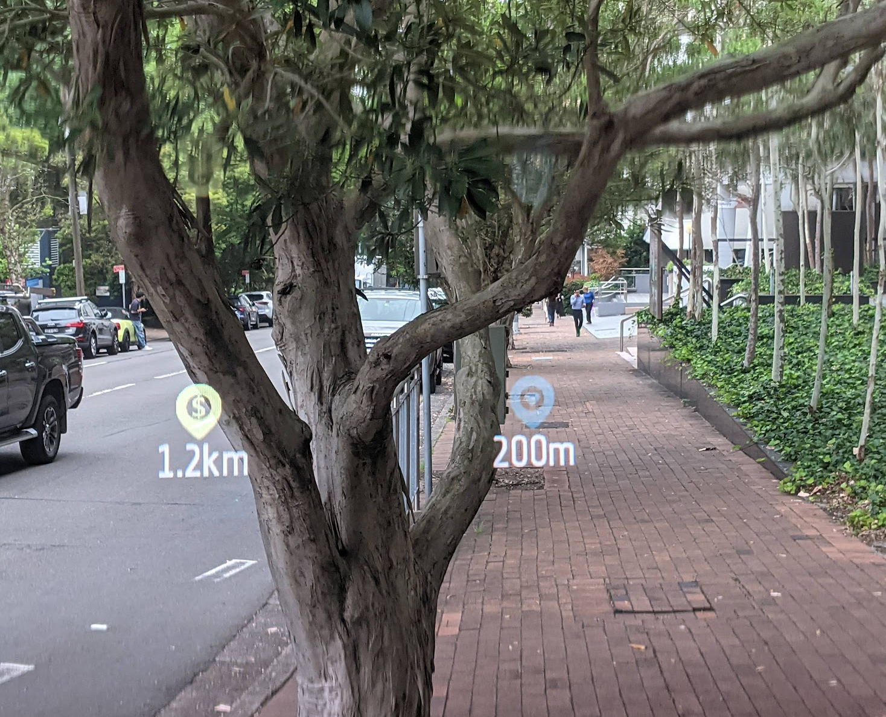
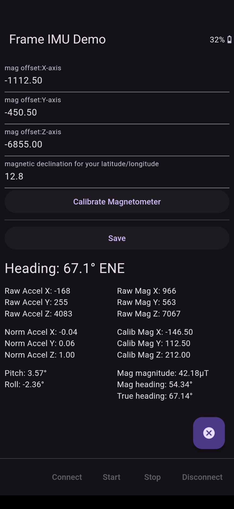

# Frame IMU Demo

Brilliant Labs Frame IMU Demo App.

Provides tilt-corrected heading using the on-Frame accelerometer and magnetometer, adjusted by an optional user-provided declination value for the location.
A basic calibration function is provided (rotate Frame slowly around all 3 axes during the calibration period), and resulting values can be manually modified and saved. Good calibration offsets are necessary for correct results.

## Frameshots

## Screenshots

